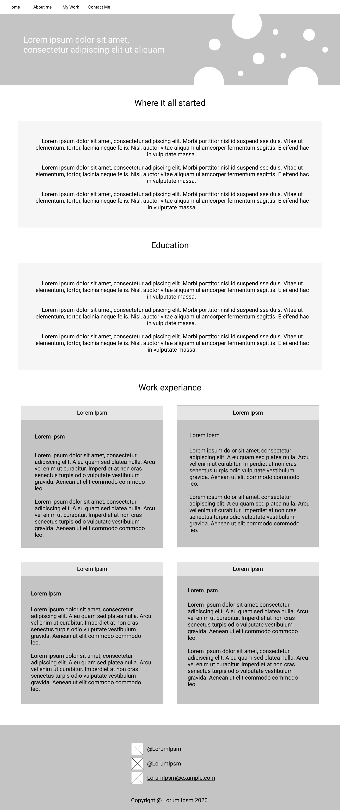

# Background

### Why did I start this project?

The background behind wanting to create this website was to help digitally brand myself online. This will help give me visibility to prospective customers and to potential employers. It can help to showcase my work and give some insight into my background, how and why I started web design and some information about my work.

The current issue is that I have no way of showing employers or customers projects I have and will work on in my time as a web developer and designer. Having this website will really help me kick start my career and show people what i'm capable of and what i have left to build on. It also provides a way for me to look back at previous projects I've worked on and improve on them or learn from my past.

In this project I have chosen to do a desktop first approach. Although most people visit a website on their mobile device before a desktop, my website is for potential employers or customers looking for a website or someone to hire. Therefore showcasing my work on a desktop is most appropriate for this scenario as it enables for lots of projects to be displayed and more information than usual to be shown.

# Wire Frames

### Desktop wireframes

#

#

#

### Mobile wireframes

#

#

#

# Colour Choices

Document the colour scheme you have used for your website and why this was chosen?
The three colours I have chosen to use are below in the hex code format:

#FFFFFF - White
#0f0f0f - Gark gray
#00C2FF - A form of greeny blue

I've chosen to do a 60% 30% 10% rule for the website in terms of the colours used. I have done 60% white, 30% blue and 10% dark gray. This is to keep the website nice and simple which will help not to overwhelm the user with lots of different bright colours all at once.

White is a nice bright neutral colour and dark gray, a dark neutral colour. This helps to give users a break, and helps to give the user time to take in and prioritise certain elements and useful information on the website.

I chose the colour blue because firstly it is common in everyday life and is well known to the user. People see lots of blue out in the world such as in the sea or sky and if often associated with them. Secondly the colour blue is shown to have a calming effect on people and symbolises trust, loyalty and wisdom. These are all good qualities for the colour blue and create a positive effect on the user. Blue is also associated with depth and stability which can hopefully make the connection to the website.

# Accessibility

Firstly I have included the use of the alt attribute to give a description of an image in the code. What this does is enables people who use screen readers (e.g. the visually inpaired) to understand what is going on in the picture.

Another measure I have taken to ensure the accessibility of the website is to ensure that the font size is the same as or above the recommended size of 16px. This ensures that no matter what device a user is on they can read the text and information on the website.

Also by using a background and text contrast ratio accessibility checker I can check that my background and text colour choices pass the accessibility standards. What it does is gives you a rating for the contrast level between the text and the background and can tell you whether it passes the standards or not.
(Link to accessibility checker: https://contrast-ratio.com)

What measures have you taken to conform to W3C accessibility standards?
The first measure I haven taken in order to conform to the W3C standards is installing a W3C validation plugin. This checks the code written against the Nu Html Checker library to make sure that the code meets the W3C standards.

# GDPR (General Data Protection Regulation)
What measures have you taken to conform to the General Data Protection Regulation?

On the website data is collected from an individual when they send a message via the contact form. Any user using a website had certain rights regarding their data, these rights consist of the 8 individual rights:

1. The right to be informed - users must be notified what data is being collected, the length of time it will be kept, how it's being used and if it is being shared with a third party.
2. Right of access - Users have the rights to ask to see any information a company keeps on the user
3. Right to rectification - Users have the right to correct any incorrect, inaccurate, or incomplete data that is kept on them.
4. Right to erase their data - Users can ask for their personal data to be deleted
5. The right to restrict processing - The user can request that the company limits the way it uses their data.
6. The right to data portability - Users can request that any data held on them be transferred to another company.
7. The right to object - users have the right to reject certain types of data processing such as directed marketing.
8. Rights in relation to automated decision making and profiling - Users can request a copy of how its automated processing activities work if they think that it's being processed illegally.

Also stating that the user is free to practice their rights and what way they can go about doing this.

### Creating a privacy policy

The first thing a person would need to include when creating a privacy policy is their name and email address. This is so that a user can get in contact if they have any concerns or issues with how their data is being handled etc.

The next thing the privacy policy will need to contain is information on the types of data that will be collected, being as specific as possible to ensure that the user understands fully what data is being collected and how it is collected.

Data will not actually be stored, only processed, but will be used to reply to the user. Consent is still required if you use the users data to reply to their message.

Notifying the user about how their personal data will be processed and whether their personal data will be shared with any third parties or not. The user will need to be notified if their information will be shared or processed outside the EU.

The length of time data is to be kept for also needs to be defined as there are different regulations on how long a person's data can be kept for specific things.

On my form I’ll be adding an opt-in checkbox to ensure that users agree to the privacy policy.

# Distance selling

My website is about displaying and showcasing my work and projects I have worked on as well as digitally branding myself online. I do not directly sell products via my website but there is a possibility for selling via phone, email or text message. This is called distance selling. In order to carry out distance selling there are several pieces of information that will need to be provided to the customer, these things include:
“
- your business name, contact details and address
- a description of your goods or services
- the price, including all taxes
- how a customer can pay
- delivery arrangements, costs and how long goods will take to arrive
- the minimum length of their contract and billing period
- conditions for ending contracts
- how they can cancel and when they lose the right to cancel
- if they will still need to pay reasonable costs for using a service after they cancel
- a standard cancellation form, if they can cancel
- conditions for money given as a deposit or financial guarantees
- what digital content does (for example, the language it’s in or how to update software)
- the cost of using phone lines or other communication to complete the contract where it will cost more than the basic rate
“

The way I will show this information is before a customer places an order with me I'll send an email with all the required information in a pdf file for the purchase to be legal, before any further steps are made in selling a product or service to the customer.

The customer will also be given notification that they have the right to cancel the services within 14 days if its an ongoing subscription, e.g. web hosting services.

After an order is placed a contract will be provided via email to the customer in the form of a pdf.

# Evaluation

### To what extent did you tackle the problem that you set out to solve?

Firstly I came up with some initial designs for the website. These consisted of wireframes outlining the bear bones of the website to make sure I was happy with the layout.

After this I developed the designs using figma to give a better understanding of what the product may look like.

I did some research into colour theory to ensure that the right colour was chosen for the job in hand. By doing this you can make sure that the customer receives the correct feel and emotion you want when the customer initially sees your website. The first instant a user is on your website they will judge it and if it has a positive outcome on the user then that is good for the website and for business.

This then enabled me to try out the colour on the website and play around with it in different ways, seeing what colours worked as accent colours and what was best for the background.

After everything about the design was decided on I went about coding the website in brackets text editor which made it easy to code.

What problems did you encounter along the way?
The hamburger menu started off a little tricky trying to get it only to appear once the screen was a certain size using media queries. Media queries were the main problem, trying to figure out what needed to change when.

### How did you test your website/web-application on multiple devices, and what did you find out?
I used google chrome inspect element to try my website out on different devices. By doing this I found out that my card group did not respond correcly to different screen sizes.
I also used my mobile phone and computer to try out the website on the different devices.

### What informed your design choices?
